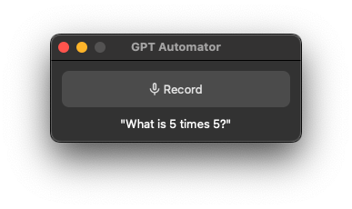

# GPT Automator



Your voice-controlled assistant. GPT Automator lets you perform tasks on your computer using your voice. For example, opening applications, looking up restaurants, and synthesizing information.

Made by [Luke Harries](https://harries.co/) and [Chidi Williams](https://chidiwilliams.com/) at
the [London EA Hackathon, February 2023](https://forum.effectivealtruism.org/events/gTSwA8RoGidjpLnf6/london-ea-hackathon).

[](https://www.loom.com/share/7bfa82c604f3412fbbb04191ce2ae12f "GPT Automator demo")

## Requirements

* [FFmpeg](https://ffmpeg.org/)

   ```shell
   # on Ubuntu or Debian
   sudo apt update && sudo apt install ffmpeg

   # on Arch Linux
   sudo pacman -S ffmpeg

   # on MacOS using Homebrew (https://brew.sh/)
   brew install ffmpeg

   # on Windows using Chocolatey (https://chocolatey.org/)
   choco install ffmpeg

   # on Windows using Scoop (https://scoop.sh/)
   scoop install ffmpeg
   ```

## Instructions

1. Install the dependencies from the `requirements.txt` or `pyproject.toml` files.
2. Create a `.env` file from the `.env.example` file and fill in the OpenAI API key.
3. Run `python gui.py` to run the GUI and click 'Record' to say your prompt. Alternatively,
   run `python main.py [prompt]`
   to run the CLI.

## How it works

GPT Automator converts your audio input to text using OpenAI's Whisper. Then, it uses a [LangChain](https://github.com/hwchase17/langchain) Agent to choose a set of actions, including generating AppleScript (for desktop automation) and
JavaScript (for browser automation) commands from your prompt using OpenAI's GPT-3 ("text-davinci-003"),
and then executing the resulting script.

## Example prompts

* Find the result of a calculation. Prompt: "What is 2 + 2?" -> It will write AppleScript to open up a calculator and type in 5 * 5.
* Find restaurants nearby. Prompt: "Find restaurants near me" -> It will open up Google search, read the text on the page, and say the best restaurants.
* Play a game of chess. Prompt: "Play a game of chess" -> It will open up Chess.com and start clicking around.

## Disclaimer

This project executes code generated from natural language and may be susceptible
to [prompt injection](https://en.wikipedia.org/wiki/Prompt_engineering#Prompt_injection) and similar
attacks. This work was made as a proof-of-concept and is not intended for production use.
